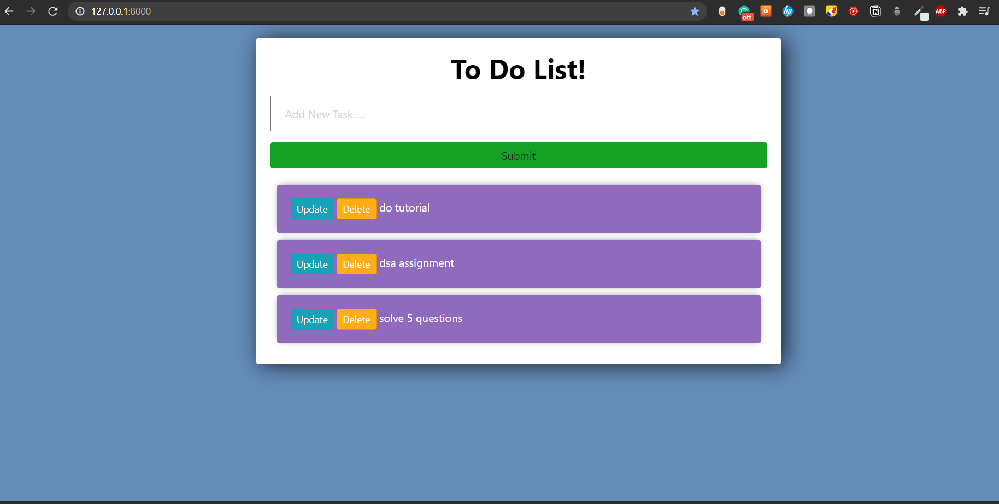
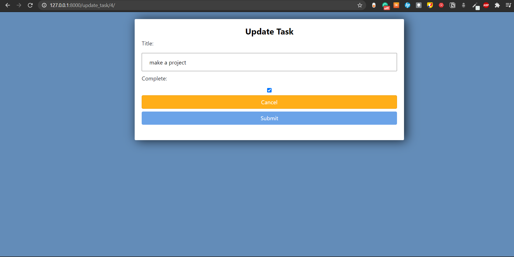
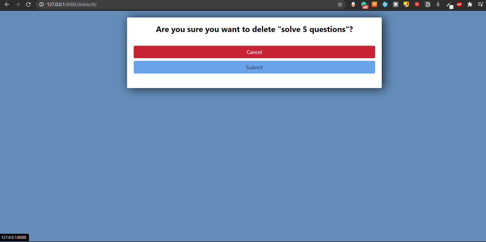

# Django To Do List Application #

It allows users to 
* Create Tasks 
* Update Tasks 
* Mark Tasks as Completed 
* Delete Tasks 

## Technologies Used : ##

* Front-End :  HTML, CSS 
* Back-End : Python Django 

## Screenshots : ##

  
  
 

